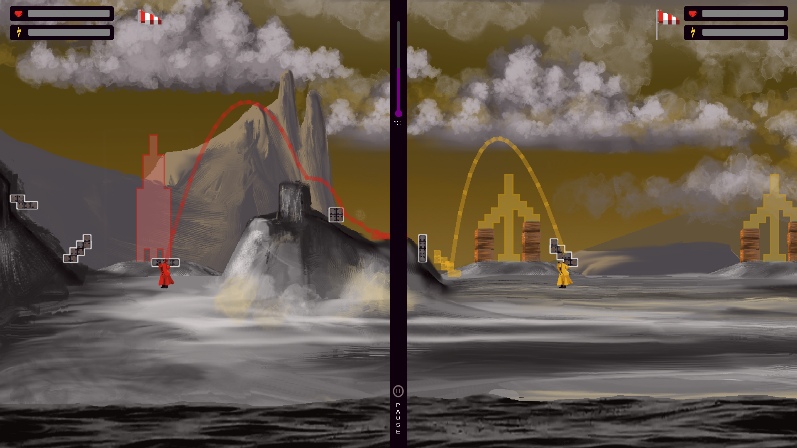

# Platformer Art Project



## Overview

This project is a video game art project that critiques space tourism in the context of climate change and environmental destruction. 

The game features two opposing players playing on splitscreen:
- One player aims to save the planet.
- The other player tries to save humanity by escaping the planet.

**Requirements:**

- tested on Java 17 (anything higher than 11 should work) and Maven 3.9.0
- 2 game controllers with at least 9 buttons and a joystick. 

You might have to rebind the buttons to the correct action (e.g. JUMP) in the code:
```sh src.utilz.Constants.ControllerConstants```

## Installation and Execution

Follow these steps to download and run the project:

1. **Clone the repository (or download the zip file):**
   ```sh git clone https://github.com/FloFmm/Platformer_Art_Project.git```
2. **Navigate to the project directory:**
```sh
cd Platformer_Art_Project
```
3. **Build the project using Maven:**
Change line 12 of pom.xml according to your OS. Then run:
```sh
mvn clean install
```

4. **Run the project:**
```sh
java -jar target-[your OS]/Platformer_Art_Project-0.0.1-SNAPSHOT.jar
```

**Contributing**

Contributions are welcome! Please fork the repository and submit a pull request for any features, bug fixes, or enhancements.

**License**

This project is licensed under the MIT License. See the LICENSE file for details.